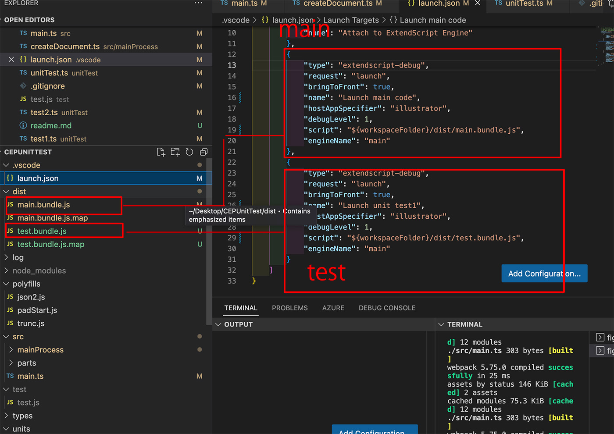

# unit test for Adobe ExtendScript and CEP

[Japanese explanation is here](https://kawano-shuji.com/justdiary/2022/11/20/adobe-extendscript-unittest/)

as you know ExtendScript is obsolete script language.
developing large scale code more complicated than new one.
therefore I developed [modernCEPEnvironment](https://github.com/tokyosheep/modernCEPEnvironment)
it can use module system and ES2015 even TypeScript on ExtendScript.

but since I developed modernEnvironment, I came up with test environment like jest.
because ES2015 can use module system(import export) that why it can call
unit function, object easily.

as it used npm modules, this project uses same modules as well below

1. Webpack
2. TypeScript
3. Babel
4. ExtendScript Debugger ver2

but Jest doesn't work on ExtendScript. I developed test enviroment by myself.
of course I can't reproduce Jest itself, even I can't develop full-scale test environment.
just I developed simple test environment.

## setting webpack config and ExtendScript Debugger ver2

through webapck, compiling test code and production like below.

```
entry: {
    main: './src/main.ts',
    test: './unitTest/mainTest.ts'
  },
  output: {
    filename: '[name].bundle.js',
    path: path.resolve(__dirname, './dist')
  }
```

main code'll be exported as a main.handle.js, and test code'll be exporteda s a test.handle.js
you can set setting on ExtendScript Debugger ver2 like below



once you set it, you can run code both main and test.
just switch to the Launch main code or Launch unit test1 on VsCode

## How to develop it

I developed test environment like Jest(I mentioned again, it'll be just like Jest but I'm not a professtional for coding, and just I need simple test environment)

I use three classes below

1. Description
2. Test
3. Result(expect)

you can expect how do these classes play thier role.
like Description plays its role like this.

```
new Description('description how can error be happned', () => {
    new Test('empty list', () => {
        ........
    }).testing();
```

aftter recieving description and callback function, Description class does the test through the testing method like Jest(I warn, it won't work untill you add testing method)

Test class and Result calss also work like it.

## Matcher

Result class has some Matchers like expect but it still has few matchers.
you may think it's enough at all but I may add more gradually if I thought I need more.
of course as Adobe made an announced that CEP will be abandoned (maybe a couple of years later? I'm not sure)
that why I won't extend this rapidly.

you could see more details in this code.